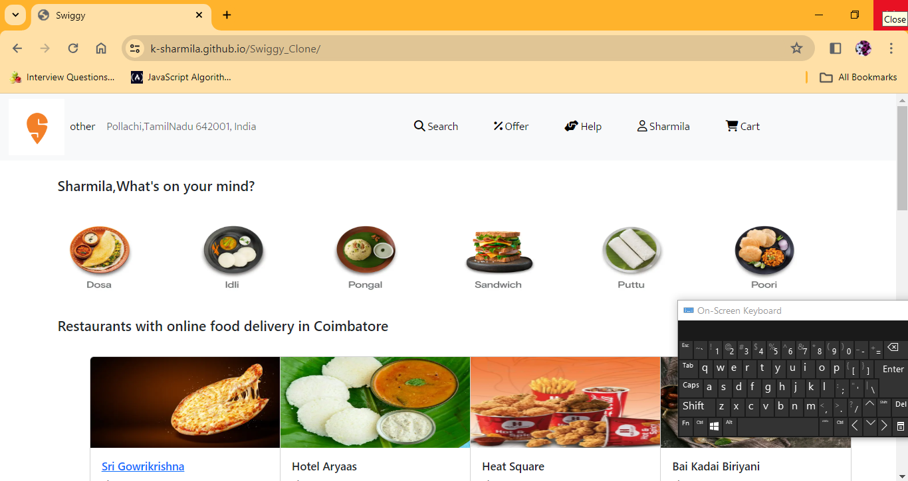
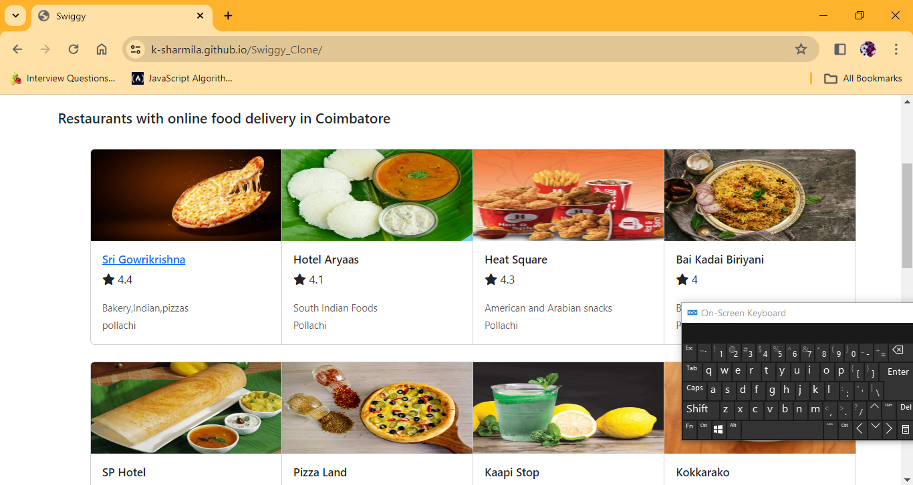

<h1> Swiggy Clone</h1>
<i>This is my recent project which I developed Using HTML,CSS,Javascript.And this is the clone of the Swiggy</i>

<h3>Hosted Link :</h3><a href="https://k-sharmila.github.io/Swiggy_Clone/"> Swiggy</a>
  

<i>Here is the screenshot of the webpage</i>

